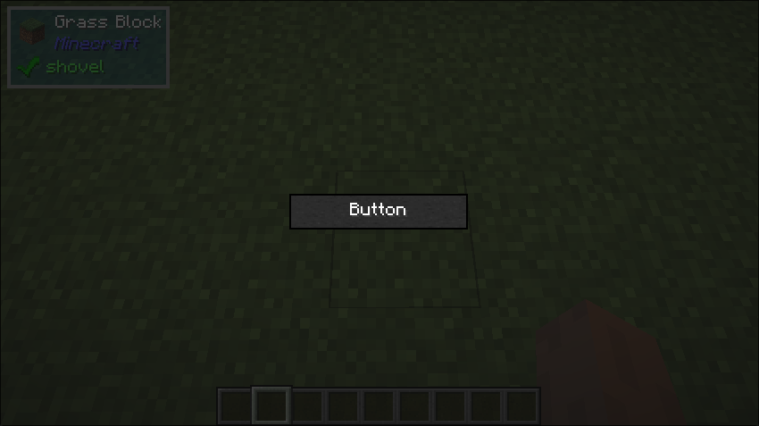

# Button

## What it does
- This behaves the same way a normal minecraft button does. Triggers an optional 
callback that will be called when the button is clicked

## Builder Parameters
1. `onPress` (Optional)
    - Called when the button is triggered. Set to `null` or do not call `withOnPress` to disable the button
    - Default: null
2. `child`
    - The child component that is displayed within the button. Normally a text.

## Space Behaviour
- Maximum

## Example
```java
public class TestButton implements UIComponent {
    @Override
    public UIComponent build(Layout layout) {
        return new Center(new Sized(
            Size.staticSize(100, 20),
            new Button.Builder()
                .build(new Center(new Text.Builder("Button")))
        ));
    }
}
```

## What it looks like
The button is grayed out because no `onPress` is defined. 


