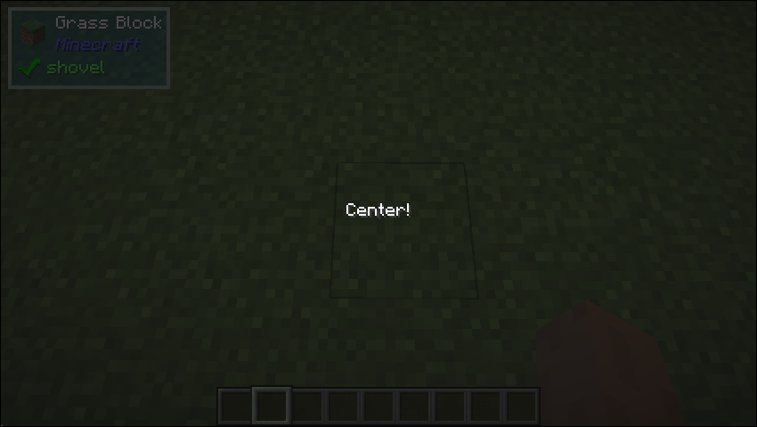

# Center

## What it does
- The center widget centers its child to the space it is given. It is the same as making an [Align](/docs/builtin-comps/align)
which aligns the child to the center on both horizontal and the vertical axis.

## Parameters
1. `child`
    - The child to center

## Space Behaviour
- Minimum

## Example
```java
public class TestCenter implements UIComponent {
    @Override
    public UIComponent build(Layout layout) {
        return new Center(new Text.Builder("Center!"));
    }
}
```

## What it looks like

