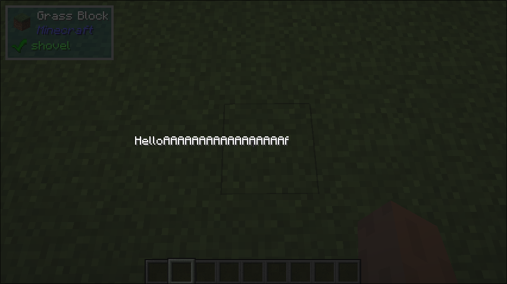

# Clip

## What it does
- Clips the child component to a given size and offset

## Builder Parameters
1. `size` (Optional)
    - The size of the clip, anything outside will not be rendered.
    - Default: the full child size
2. `offset` (Optional)
    - The offset of the clip starting from the top-left corner of the child.
    - Default: (0, 0)
3. `child`
    - The `UIComponent` to be clipped.

## Size Behaviour
- Minimum

## Example
```java
public class TestClip implements UIComponent {
    @Override
    public UIComponent build(Layout layout) {
        return new Center(
            new Clip(
                new Text.Builder("HelloAAAAAAAAAAAAAAAAAAAAAAAAAAAAA"), 
                new Vector2i(0, 0), 
                Size.percentage(0.65f, 1f)));
    }
}
```

## What it looks like

