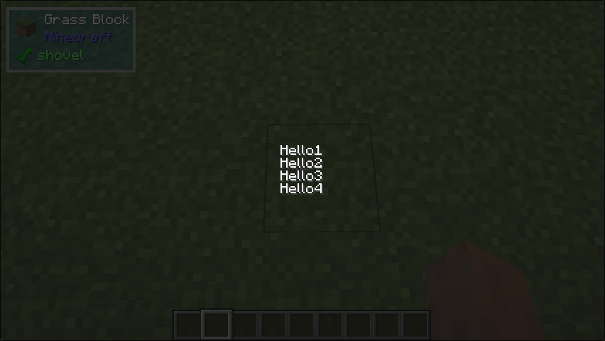

# Column

## What it does
- The `Column` class is a UI component that arranges its child components in a vertical column.

## Builder Parameters
1. `children`
    - The children of to arrange in a column.
2. `spacing` (Optional)
    - The amount of space between each child component.
    - Default: 0 
3. `sizeBehaviour` (Optional)
    - The behavior of the `Column` in regard to its size.
    - Default: min
4. `alignment` (Optional)
    - The horizontal alignment of the children.
    - Default: Center

## Space Behaviour
- Can be changed via parameter `sizeBehaviour`

## Example
```java
public class TestColumn implements UIComponent {
    @Override
    public UIComponent build(Layout layout) {
        return new Center(
            new Column.Builder().build(
                new Text.Builder("Hello1"),            
                new Text.Builder("Hello2"),            
                new Text.Builder("Hello3"),            
                new Text.Builder("Hello4")            
        ));
    }
}
```

## What it looks like

