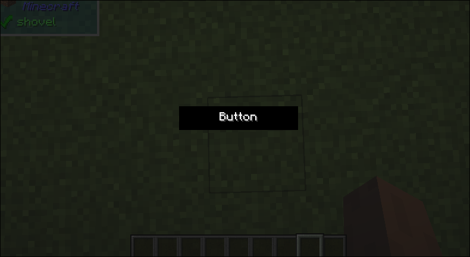

# Flat Button

## What it does
- This is a more customizable button with a single flat color

## Builder Parameters
1. `onPress` (Optional)
    - Callback that will be triggered when the button is perssed
    - Default: null
2. `disabledColor` (Optional)
    - The color that will be used for the button when `onPress` is null
    - Defaut: Gray
3. `hoveredColor` (Optional)
    - The color that will be used for the button when the mouse is hovering
    - Default: Light Cyan
4. `normalColor` (Optional)
    - The normal color when not hovering and not disabled
    - Default: Jade Green
5. `child`:
    - The child to be displayed on top of the button

## Size Behaviour
- Maximum

## Example
```java
public class TestFlatButton implements UIComponent {
    @Override
    public UIComponent build(Layout layout) {
        return new Center(new Sized(
                Size.staticSize(100, 20),
                new FlatButton.Builder()
                        .withOnPress((b) -> {})
                        .build(new Center(new Text.Builder("Button")))
        ));
    }
}
```

## What does it look like

