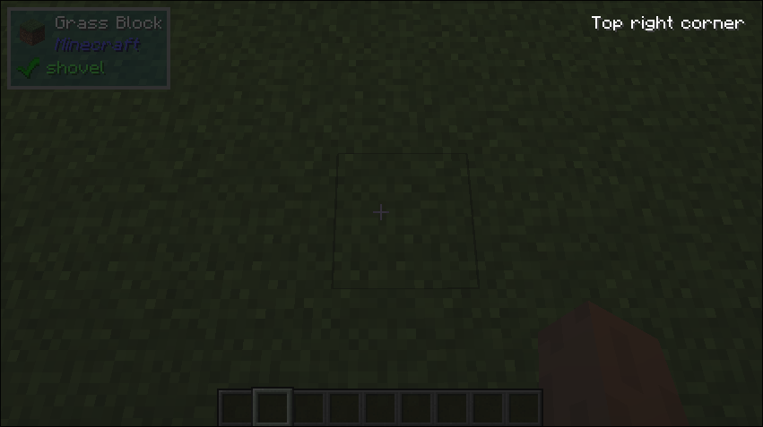

# Padding

## What it does
- This UI component adds padding around another UI component.

## Parameters
1. `pad`:
   - A `Pad` object that specifies the amount of padding to add on each side of the child component.
2. `child`:
   - The child UI component that will be padded.

## Size Behaviour
- Minimum

## Example
```java
public class TestPadding implements UIComponent {
    @Override
    public UIComponent build(Layout layout) {
        return new Align.Builder()
                .withVertical(LayoutSetting.START)
                .withHorizontal(LayoutSetting.END)
                .build(new Padding(
                    new Pad.Builder().withRight(10).withTop(10).build(), 
                    new Text.Builder("Top right corner")));
    }
}
```

## What it looks like

