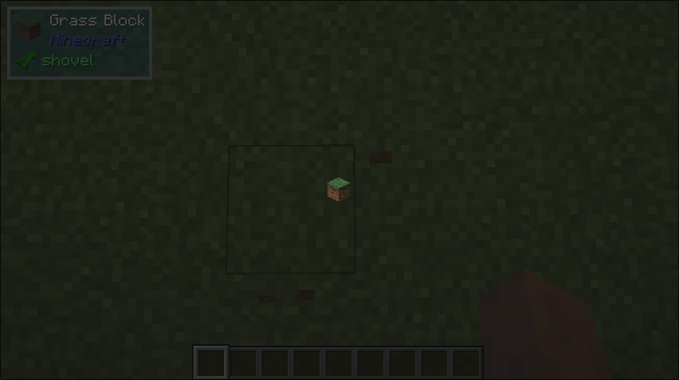

# Render

## What it does
- This UI component allows for custom rendering of graphics.

## Parameters
1. `renderer`
   - A `RenderProvider` callback that provides the custom rendering logic.

## Size Behaviour
- Maximum

## Example
```java
public class TestRender implements UIComponent {
    @Override
    public UIComponent build(Layout layout) {
        return new Center(new Sized(
            Size.staticSize(16, 16),
            new Render(new ItemRenderProvider(Items.GRASS_BLOCK))
        ));
    }
}
```

## What it looks like

