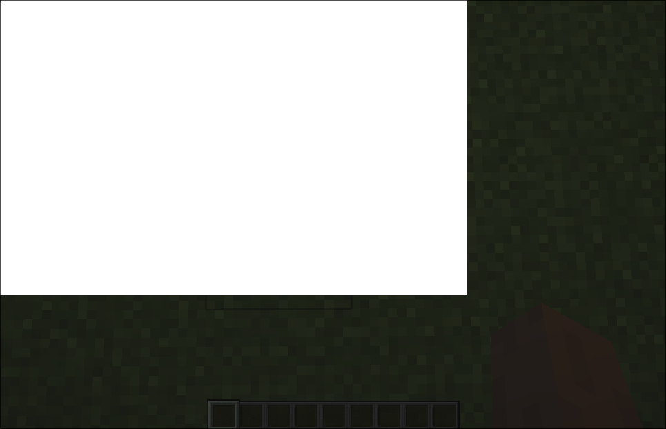

# Renderable

## What it does
- This is just a wrapper for `IRenderable` interface

## Parameters
1. `renderable`
    - The `IRenderable` to wrap.

## Size Behaviour
- Maximum

## Example
```java
public class TestRenderable implements UIComponent {
    @Override
    public UIComponent build(Layout layout) {
        return new Renderable(((pMatrixStack, pMouseX, pMouseY, pPartialTicks) -> {
            AbstractGui.fill(pMatrixStack, 0, 0, pMouseX, pMouseY, Color.WHITE.getAARRGGBB());
        }));
    }
}
```

## What it looks like

