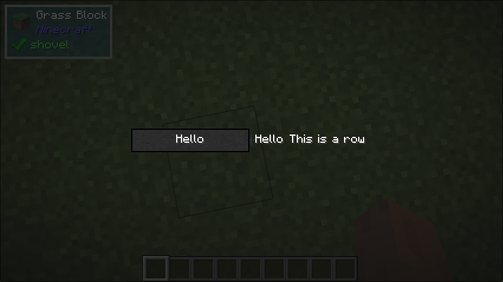

# Row 

## What it does
- This UI component arranges its child components in a horizontal row with a fixed spacing between them.

## Builder Parameters
1. `children`
    - The children of to arrange in a row.
2. `spacing` (Optional)
    - The amount of space between each child component.
    - Default: 0 
3. `sizeBehaviour` (Optional)
    - The behavior of the `Row` in regard to its size.
    - Default: min
4. `alignment` (Optional)
    - The vertical alignment of the children
    - Default: Center

## Size Behaviour
- Can be modified via `sizeBehaviour`

## Example
```java
public class TestRow implements UIComponent {
    @Override
    public UIComponent build(Layout layout) {
        return new Center(new Row.Builder()
            .withSpacing(5)
            .build(
                new Sized(
                    Size.staticSize(100, 20),
                    new Button.Builder().build(new Center(new Text.Builder("Hello")))
                ),
                new Text.Builder("Hello"),
                new Text.Builder("This is a row")
            ));
    }
}
```

## What it looks like

