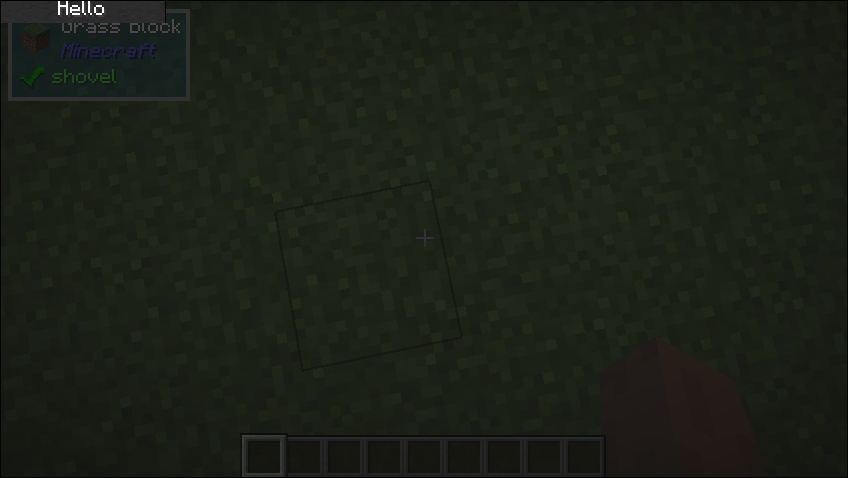

# Sized

## What it does
- Sized UIComponent is a UI component that resizes its child component to a specified size. This is mostly used to restrict the size of a UIComponnet with the Size Behaviour of Maximum

## Parameters
1. `size`
    - The size of the `UIComponent`
    - Takes in a type of Size, which is a `FunctionalInterface` that takes in a maximum size and returns the size of that the component will use. You can use the pre-built `Size.staticSize(int, int)` for a fixed size or use `Size.percentage` to fill a percentage of the given space.
2. `child`
    - the `UIComponent` to be resized.

## Size Behaviour
- Fixed

## Example
```java
public class TestSized implements UIComponent {
    @Override
    public UIComponent build(Layout layout) {
        return new Sized(
                Size.percentage(0.2f, 0.05f),
                new Button.Builder().build(new Center(new Text.Builder("Hello")))
        );
    }
}
```

## What it looks like

