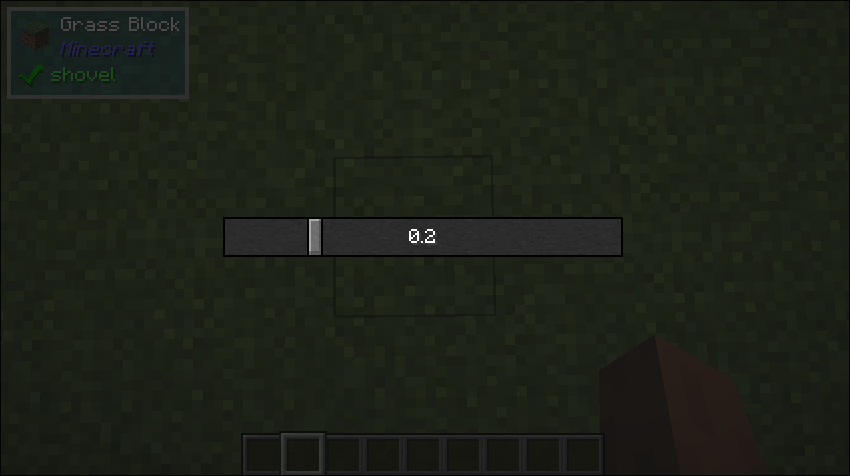

# Slider

## What it is
- This is just a regular slider you see in any UI.

## Builder Parameters
1. `prefix` (Optional)
    - The prefix that will be displayed before the value of the slider
    - Default: null
2. `suffix` (Optional)
    - The suffix that will be displayed after the value of the slider
    - Default: null
3. `showDecimals` (Optional)
    - Whether or not to show the decimal part of the slider value
    - Default: true
4. `value` (Optional)
    - The initial value of the slider
    - Default: 0
5. `minimum` (Optional)
    - The minimum value of the slider
    - Default: 0
6. `maximum` (Optional)
    - The maxmimum value of the slider
    - Default: 1
7. `onPress` (Optional)
    - Callback that will be triggered when the slider area is clicked
    - Default: null
8. `onValueChanged` (Optional)
    - Callback that will be triggered when the slider changes
    - Default: null

## Size Behaviour
- Maximum

## Example
```java
public class TestSlider implements UIComponent {
    
    private double value;
    
    @Override
    public UIComponent build(Layout layout) {
        return new Center(
            new Sized(
                Size.staticSize(200, 20),
                new Slider.Builder()
                    .withValue(value)
                    .withOnValueChanged((value) -> this.value = value)
            )
        );
    }
}
```

## What it looks like

