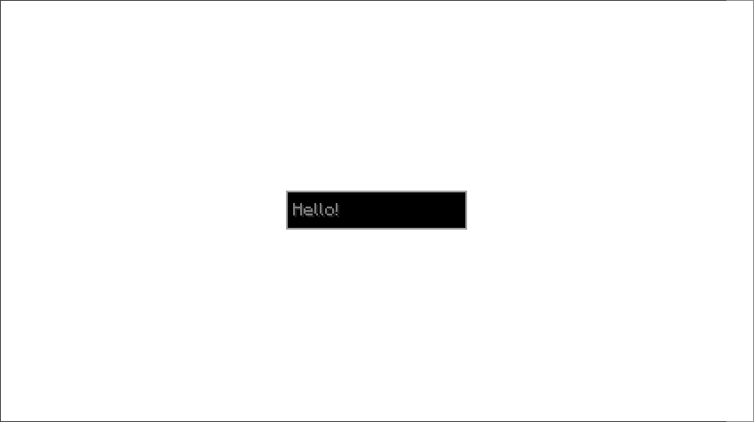

# Stack 

## What it does
- Stack UIComponent is a container that stacks its child components on top of each other.

## Parameters
1. `children` 
    - A list of `UIComponent` objects to be stacked on top of each other, in the order declared.

## Size Behaviour
- Maximum

## Example
```java
public class TestStatic implements UIComponent {
    @Override
    public UIComponent build(Layout layout) {
        return new Stack(
            new Container.Builder().withColor(Color.WHITE),
            new Center(new Sized(
                    Size.staticSize(new Vector2i(100, 20)),
                    new TextField.Builder()
                            .withMessage(new StringTextComponent("Hello"))
                            .withHintText(new StringTextComponent("Hello!")))
            ));
    }
}
```

## What it looks like


Yes this is the same image and code as the one in Getting Started but shhh I think you get it.
