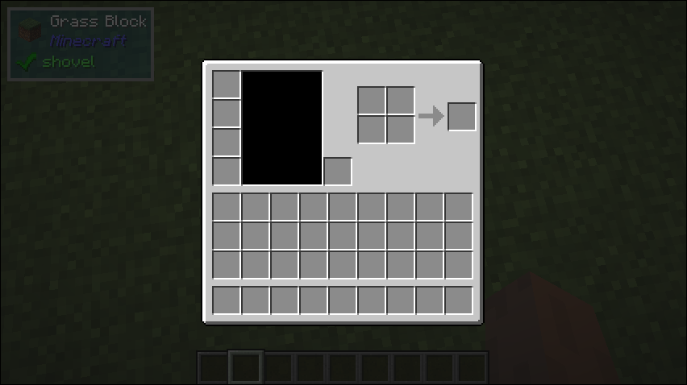

# Texture

## What it does
- Draws a texture onto the screen

## Builder Parameters
1. `textureSize` (Optional)
    - The size of the texture image file.
    - Default: 256x256
2. `uv` (Optional)
    - The uv coordinate to draw from on the texture file.
    - Default: (0, 0)
3. `uvSize` (Optional)
    - The size of the area on the texture to be drawn.
    - Default: the texture size
4. `size` (Optional)
    - The size the texture should be displayed
    - Default the uv size
5. `texture`
    - The `ResourceLocation` of the texture file.

## Space Behaviour
- Minimum

## Example
```java
public class TestTexture implements UIComponent {
    @Override
    public UIComponent build(Layout layout) {
        return new Center(new Texture.Builder(InventoryScreen.INVENTORY_LOCATION)
                .withUvSize(new Vector2i(176, 166));
    }
}
```

## What it looks like
<!--  -->
