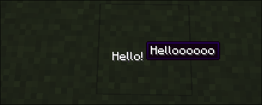

# Tooltip

## What it does
- When its child is hovered, renders a tooltip on the screen

## Builder Parameters
1. `text`
    - The text to be drawn, can be added by a list to create multiple lines.
2. `child`
    - The `UIComponent` that will display the tooltip when hovered.

## Size Behaviour
- Minimum

## Example
```java
public class TestTooltip implements UIComponent {
    @Override
    public UIComponent build(Layout layout) {
        return new Center(new Tooltip.Builder()
                .withText(new StringTextComponent("Helloooooo"))
                .build(new Text.Builder("Hello!")));
    }
}
```

## What it looks like

