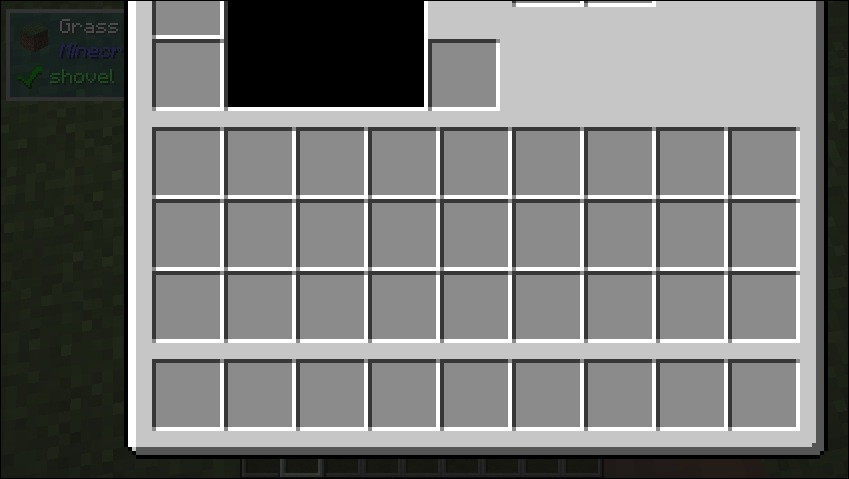

# Transform

## What it does
- Allows manual transformation to be applied to child `UIComponent`

## Parameters
1. `child` 
    - The child `UIComponent` to be transformed.
2. `transformations` (Optional)
    - The transformations to apply. Currently, available transformations are `scale` and `translation`.
    - Default: null

## Size Behaviour
- Minimum

## Example
```java
public class TestTransform implements UIComponent {
    @Override
    public UIComponent build(Layout layout) {
        return new Transform(
            new TestTexture(),
            new ScaleTransform(new Vector3f(2, 2, 1)),    
            new TranslationTransform(new Vector3f(-93, -88, 0))    
        );
    }
}
```

## What it looks like

