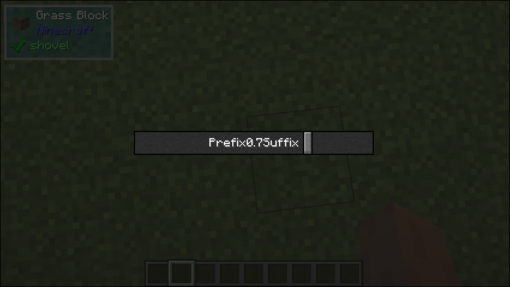

# Widget Wrapper

## What it does
- This is basically a wrapper for any minecraft widgets or any class that extends the minecraft `Widget` class, and allows it to be used in Tau UIs. This can be really useful and as you can see in the example snippet below, it's really easy to just create a component for Forge's slider implementation.

## Parameters
1. `child`
    - The Widget to display.

## Size Behaviour
- Maximum

## Example
```java
public class TestWidgetWrapper implements UIComponent {
    @Override
    public UIComponent build(Layout layout) {
        return new Center(new Sized(
            Size.staticSize(200, 20),
            new WidgetWrapper(new Slider(
                0, 0, 0, 0,
                new StringTextComponent("Prefix"),
                new StringTextComponent("Suffix"),
                0, 1, 0, true, true, (a) -> {}
            ))
        ));
    }
}
```

## What it looks like

