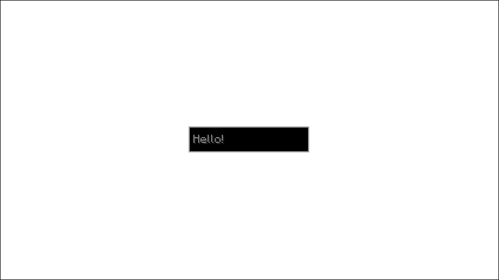

# Basics of Tau

## UI Component
`UIComponent`s are the very foundation of Tau UIs. All Tau UIs will be made up of `UIComponent`s. This is similar to Flutter's `StatelessWidget`.

A `UIComponent` is anything that can be displayed onto the screen. The fact that everything is a `UIComponent` means 
you can nest them as much as you want. In fact, that's how you would make more complex UIs without creating a indentation hell.

## Creating a UI
You can get started with creating a Tau UI by simply creating a class implementing the `UIComponent` interface

Here is an example:
```java
public class ExampleUI implements UIComponent {
    @Override
    public UIComponent build(Layout layout, Theme theme) {
        return new Stack(
            new Container.Builder(),
            new Center(new Sized(
                Size.staticSize(new Vector2i(100, 20)),
                new TextField.Builder()
                    .withMessage(new StringTextComponent("Hello"))
                    .withHintText(new StringTextComponent("Hello!")))
        ));
    }
}

```
So here, the `ExampleUI` is made up of a list of various UI Components. Let's take a brief look at each of them.

### Stack
A [Stack](/docs/builtin-comps/stack) is a built-in component that takes in a list of UI Components 
and stack them on top of each other in the order they are declared in.

### Container
A [Container](/docs/builtin-comps/container) is an empty space filling component. It can be filled with any color. Here, it's being filled with the built-in `WHITE` color

:::info
Here you can see that instead of instantiating a Container directly,
it is instantiating an instance of `Container.Builder`. This pattern can be seen in many of the built-in components in order
to clearly declare optional parameters. Note, that no `build` call was necessary. That's because the `Builder` also implements
`UIComponent` and calls `build` automatically to reduce code complexity. However, some `Builders` which has mandatory parameter(s) will
require a build call and require you to pass in the mandatory parameter(s) there.
:::

### Center
The [Center](/docs/builtin-comps/center) component will center its child to the space it's given by the layout. In this case, the center of the screen.

### Sized
The [Sized](/docs/builtin-comps/sized) component will restrict its child to the given size. [Size](/docs/builtin-comps/sized) can be a percentage of the maximum space available, or a 
fixed size given in pixel space like it is here.

### Text Field
The [Text Field](/docs/builtin-comps/textfield) component is, you guessed it, a text field that you can input text into. Here you can
see another Builder. Being supplied with a narration message and a hint text. 

:::info
`TextField` uses a built-in called [Widget Wrapper](/docs/builtin-comps/widget-wrapper). 
It can be very useful, and it is something worth looking into :smile:
:::

Overall, this is what the UI looks like.

